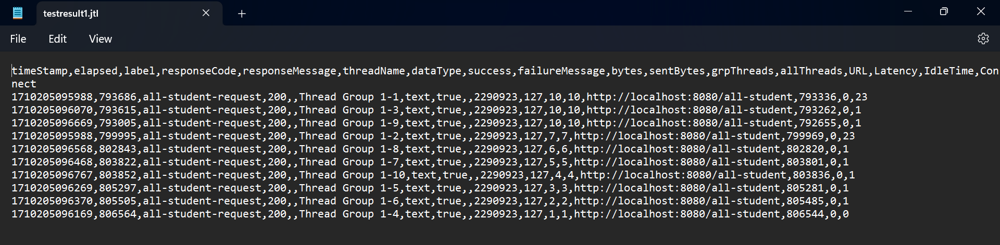
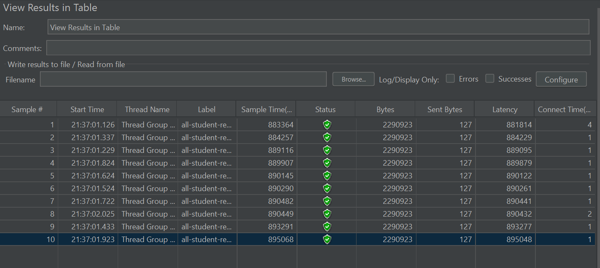
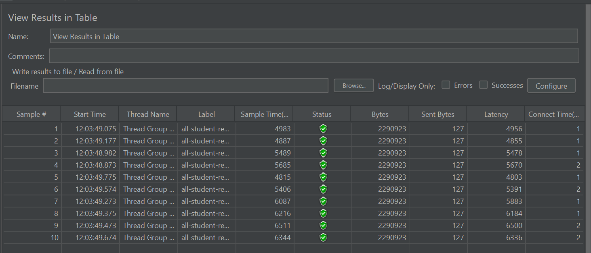
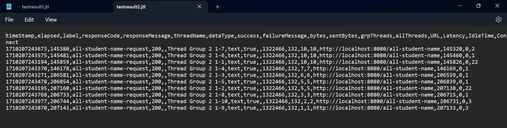
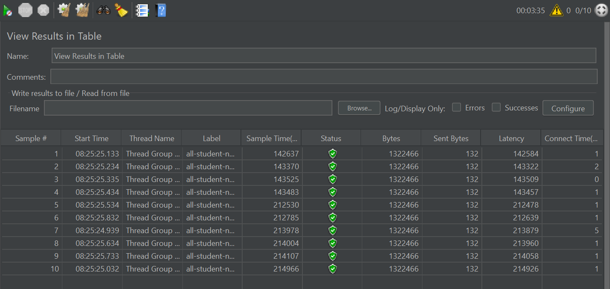
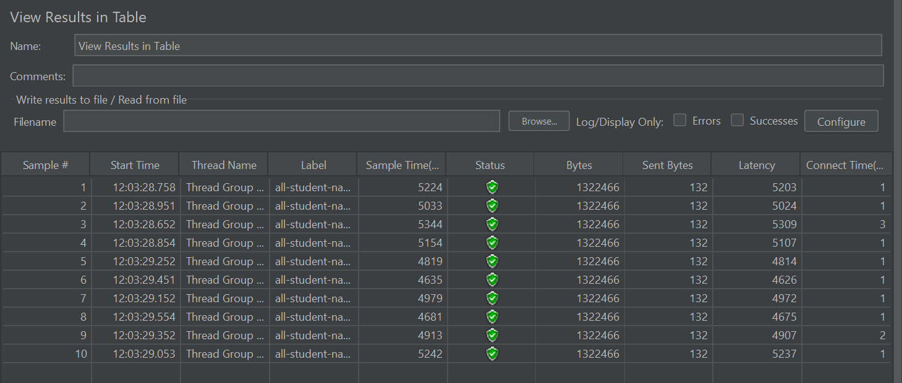
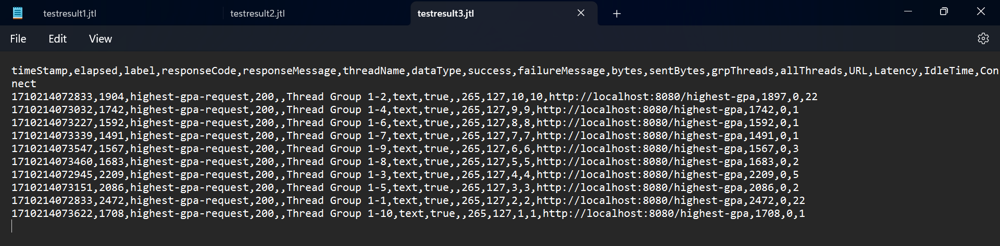
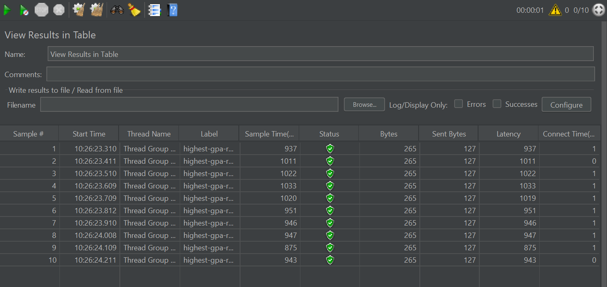
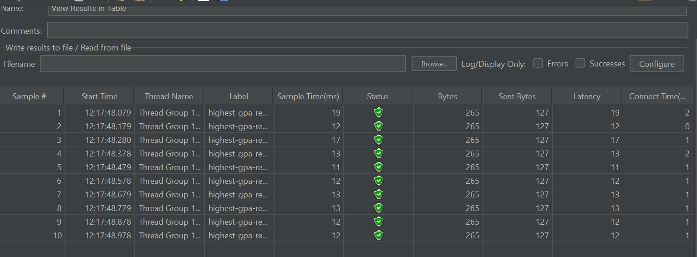

# **Modul 5**
## JMeter Report and Test Results
### **Endpoint** `/all-student`
Test Result JMeter

Before Optimization JMeter:

After Optimization JMeter:

Execution Time `getAllStudentWithCourses()` from Intellij Profiler:

| Before | After | Diff Percentage |
| -- | -- | -- |
| 16,589 ms | 1,498 ms | 90.97% |

### **Endpoint** `/all-student-name`
Test Result JMeter:

Before Optimization JMeter:

After Optimization JMeter:

Execution Time `joinStudentNames()` from Intellij Profiler:

| Before | After  | Diff Percentage |
|--------|--------| -- |
| 22,197 ms | 1,167 ms | 94.74% |

### **Endpoint** `/highest-gpa`
Test Result JMeter:

Before Optimization JMeter:

After Optimization JMeter:

Execution Time `findStudentWithHighestGpa()` from Intellij Profiler:

| Before | After | Diff Percentage |
|--------|-------| -- |
| 919 ms | 144 ms | 84.33% |
